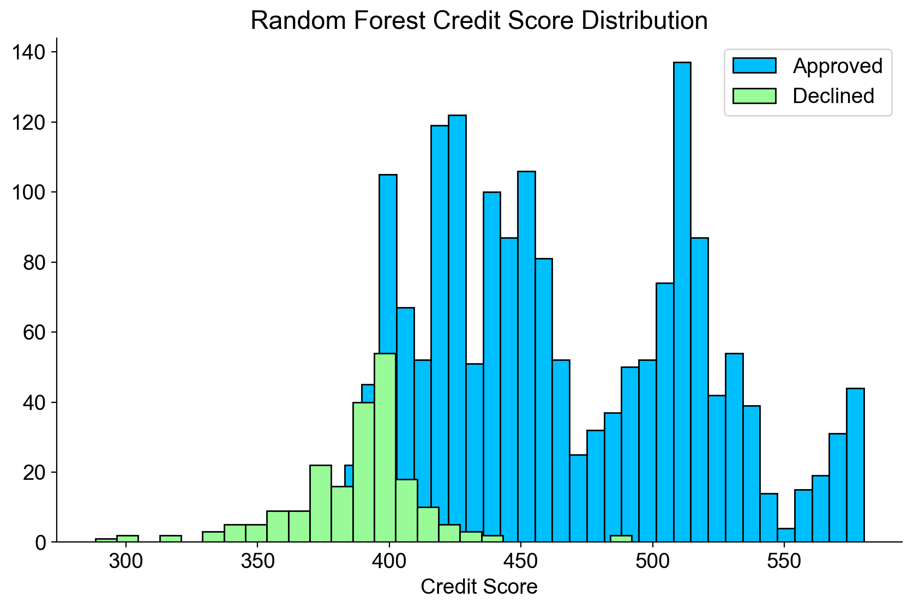
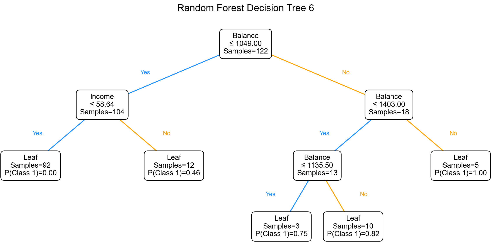

# rf-explainer

[](LICENSE)


**`rf-explainer`** is a Python package designed to analyze, visualize, and interpret Random Forest models. It works with `scikit-learn` and supports advanced functionality like scorecards and tree-based feature visualization. Future versions aim to extend support for frameworks like `XGBoost`'s implementation of Random Forest.

The scikit-learn was chosen as the primary framework for this project due to its implementation of the Fisher-Yates algorithm for node splitting.

This is a purely experimental project and is not intended for production use. The package is under active development, and contributions are welcome.

## Features

- **Tree Visualization**:
  - Display detailed decision tree structures.
  - Enrich nodes with probabilities, samples, impurity, and split thresholds.
  - Supports interactive visualization using `rich` and static visualizations with `matplotlib`.

- **Credit Scoring**:
  - Compute credit scores from Random Forest predictions.
  - Apply scaling factors (e.g., PDO, target points) for score calibration.
  - Output Probability, Weight of Evidence (WOE), and credit scores.

- **Feature Analysis**:
  - Extract node-level metrics like class distributions, impurity, and samples.
  - Trace path conditions for leaf nodes.
  - Compute per-tree predictions for interpretability.

## Usage

#### Access tree and leaf data to analyze feature splits and other metrics in one dataframe:

```python
from rf_explainer import RandomForestAnalyzer
analyzer = RandomForestAnalyzer(rf, features, ["Good", "Bad"])
tree_data = analyzer.extract_tree_data_with_conditions()
leaf_data = analyzer.extract_leaf_nodes_with_conditions()

# Print tree data
analyzer.print_tree(tree_id=0)
```

Below is an example of the output from the `print_tree` method:

```pl
Balance <= 960.50 [Samples: 130, Impurity: 0.2755, P(C=1): 0.17]
|   Income <= 63.98 [Samples: 105, Impurity: 0.0822, P(C=1): 0.04]
|   |   Leaf (Yes) [Samples: 93, Impurity: 0.0000, P(C=1): 0.00]
|   |   Leaf (No) [Samples: 12, Impurity: 0.4444, P(C=1): 0.33]
|   Balance <= 1436.50 [Samples: 25, Impurity: 0.4178, P(C=1): 0.70]
|   |   Balance <= 1101.00 [Samples: 19, Impurity: 0.4829, P(C=1): 0.59]
|   |   |   Leaf (Yes) [Samples: 8, Impurity: 0.5000, P(C=1): 0.50]
|   |   |   Leaf (No) [Samples: 11, Impurity: 0.4444, P(C=1): 0.67]
|   |   Leaf (No) [Samples: 6, Impurity: 0.0000, P(C=1): 1.00]
```

In future versions, additional metrics may be added.

#### Compute credit scores from a Random Forest model:
```python
# Predict data point
analyzer = RandomForestAnalyzer(rf, features, ["Good", "Bad"])
```
#### Create scores and visualize results:
```python

```



#### Plot trees from a Random Forest model. Custom metric to be added in future versions:
```python
from rf_explainer import RandomForestVisualizer
visualizer = RandomForestVisualizer(tree_data)
visualizer.plot_tree(tree_id=5, figsize=(14, 6))
```



## Installation

### Install from GitHub
You can install directly from the GitHub repository:

```bash
pip install git+https://github.com/xRiskLab/rf-explainer.git
```

Author: [www.github.com/deburky](www.github.com/deburky)
